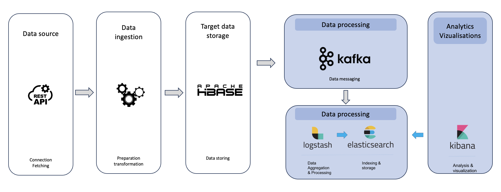

# Traffic Monitoring for Rennes Métropole

### Urban Challenges in the City of Rennes

- **Security Issues**
  - Allocation of law enforcement to the most dangerous areas
  - Deployment of automated traffic cameras
- **Traffic Congestion Management**
  - Adjust traffic signal timings
  - Recommend alternative routes
  - Schedule roadwork during off-peak hours
  - Alert for pollution spikes related to traffic

### Technological Challenges

- Large data volumes
- Need for real-time analysis and scalability

## Data Structure

| Variable Name                  | Type      | Description                                           |
|--------------------------------|-----------|-------------------------------------------------------|
| averagevehiclespeed            | integer   | Average speed of vehicles                             |
| congestion_level               | text      | Level of congestion                                   |
| datetime                       | date      | Date and time                                         |
| datetime_random                | date      | Randomized date and time                              |
| day_of_week                    | text      | Day of the week                                       |
| day_of_week_random             | text      | Randomized day of the week                           |
| denomination                   | text      | Denomination                                          |
| geo_point_2d                   | geo_point | Geographic coordinates (point)                       |
| geo_shape                      | geo_shape | Geographic shape                                      |
| gml_id                         | text      | GML identifier                                        |
| hierarchie                     | text      | Hierarchy                                             |
| hierarchie_dv                  | text      | Hierarchy (DV version)                                |
| hour_range                     | text      | Hour range                                            |
| hour_range_random              | text      | Randomized hour range                                 |
| id_rva_troncon_fcd_v1_1        | text      | FCD segment identifier version 1.1                   |
| insee                          | text      | INSEE code                                            |
| predefinedlocationreference    | text      | Predefined location reference                         |
| speed_compliance               | text      | Speed compliance (respected or violated)             |
| speed_excess                   | integer   | Speed excess                                          |
| time_of_day                    | text      | Time of day                                           |
| traffic_density                | integer   | Traffic density                                       |
| trafficstatus                  | text      | Traffic status                                        |
| traveltime                     | integer   | Travel time                                           |
| traveltimereliability          | integer   | Travel time reliability                               |
| unique_denomination            | text      | Unique denomination                                   |
| vehicle_probe_count            | integer   | Number of vehicle probes                              |
| vehicleprobemeasurement        | text      | Vehicle probe measurement                             |
| vitesse_maxi                   | integer   | Maximum allowed speed                                 |

## Architecture

