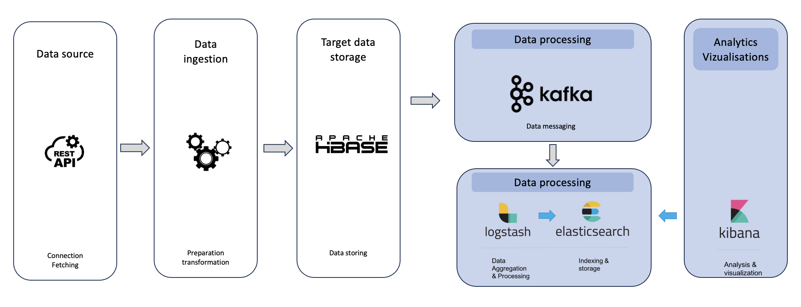

👋 Hi, I am Jaouad

Welcome to my project portfolio page. I hope you enjoy exploring my work!

*Please note: I am still working on this portfolio and will be making significant updates in the coming days.*

<h1 align="center">📁 Projects Overview</h1>

## 🚀 Project 1: Developing a Machine Learning Web App using Streamlit
[🔍 View Project Details](Developing-a-Machine-Learning-Web-App-with-Streamlit/README.md)

&nbsp;  
&nbsp;  
&nbsp;

---

## 🕸️ Project 2: Webscraping Books Data with MongoDB  
[🔍 View Project Details](Webscraping-books-data-using-MongoDB/README.md)

&nbsp;  
&nbsp;  
&nbsp;  

---

## 🚧 Project 3: Monitoring Real-Time Road Traffic using Kafka and ELK  

### Urban Challenges in the City of Rennes

- **Security Issues**
  - Allocation of law enforcement to the most dangerous areas
  - Deployment of automated traffic cameras
- **Traffic Congestion Management**
  - Adjust traffic signal timings
  - Recommend alternative routes
  - Schedule roadwork during off-peak hours
  - Alert for pollution spikes related to traffic

### Data Pipeline Architecture

### Demo

&nbsp;  
&nbsp;  
&nbsp;

---

## 🧀 Project 4: Big Data - Improving Customer Loyalty Program for a Cheese Manufacturer (Hadoop, HBase, PowerBI)  
*In Progress*

&nbsp;  
&nbsp;  
&nbsp;

---

## 🎬 Project 5: Database Movie Website (Spring Boot)
*In Progress*

&nbsp;  
&nbsp;  
&nbsp;

---

### 🌟 Stay Tuned!  
I'm continuously updating my projects and adding new ones. Feel free to reach out if you have any questions or opportunities!

---

### 📫 Connect with Me  
- [LinkedIn](https://www.linkedin.com/in/jaouad-s-42928226/)  
- [GitHub](https://github.com/Jawouaahhh)  
- [Email](mailto:back2thedata@gmail.com)

---
